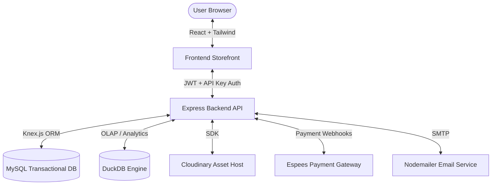

# 🛍️ Fashion Redemption

An enterprise-grade, high-performance full-stack e-commerce platform designed for premium apparel retailers. Built on a modern **React + TypeScript** frontend and a robust **Node.js + Express** backend, the application integrates transaction-safe SQL storage with next-generation analytical querying to deliver a fast, responsive, and secure shopping experience.

---

## 🏗️ System Architecture



---

## ✨ Core Features

###  Storefront & User Experience
*   **Dynamic Product Catalog**: Interactive layouts featuring responsive filters, sorting, and search capabilities.
*   **Interactive Cart & Wishlist**: Real-time updates using React Context with full persistent session support.
*   **Complete Checkout Flow**: Multi-step checkout with address validation, shipping method selection, and secure card payments.
*   **Aesthetic Visuals & Animations**: High-fidelity micro-interactions and smooth transitions powered by **Framer Motion**.

###  Backend & Data Engineering
*   **Dual-Engine Database Architecture**:
    *   **MySQL** handles high-concurrency transactional writes (users, orders, products) via the **Knex.js ORM**.
    *   **DuckDB** runs in-process to execute analytical queries over sales and user behavior without overloading the primary database.
*   **Secure Authentication**: Secure password hashing via **bcryptjs** and session management using stateless **JSON Web Tokens (JWT)**.
*   **Role-Based Access Control**: Route protection enforcing distinct permissions for customers and administrators.
*   **Cloud Asset Management**: Integrated **Cloudinary** storage for high-performance, responsive image transformations.
*   **Automated Email Pipelines**: Transactional emails for order confirmations and authentication events.

###  Admin Operations & Analytics
*   **Business Intelligence Dashboard**: Rich charting (sales trends, user registrations, popular categories) powered by **Recharts**.
*   **Inventory Management**: Full CRUD operations for products, variants, and stock control.
*   **Order Fulfillment Console**: Real-time order tracking, state management, and user history logs.

---

##  Technology Stack

### Frontend
*   **Framework**: React 19 (TypeScript)
*   **Build Tool**: Vite
*   **Styling**: Tailwind CSS / PostCSS
*   **Animations**: Framer Motion
*   **Data Visualization**: Recharts
*   **Icons**: Lucide React

### Backend
*   **Runtime**: Node.js (ES Modules)
*   **Framework**: Express
*   **Databases**: MySQL (MariaDB compatible), DuckDB (OLAP analytical engine)
*   **ORM / Query Builder**: Knex.js
*   **Security**: bcryptjs, jsonwebtoken, API Key authorization middleware

---

##  Getting Started

### Prerequisites
*   [Node.js](https://nodejs.org/) (v18.x or higher recommended)
*   [MySQL](https://www.mysql.com/) server running locally or hosted

### Installation

1. **Clone the repository and enter the directory**:
    ```bash
    git clone https://github.com/pereedi/fashion_redemption.git
    cd fashion_redemption
    ```

2. **Install dependencies**:
    ```bash
    npm install
    ```

3. **Configure Environment Variables**:
    Create a `.env` file in the root directory (you can copy the example configuration):
    ```bash
    cp .env.example .env
    ```
    *Refer to the [Environment Variables](#-environment-variables) section below to configure your database, Cloudinary, and gateway keys safely.*

4. **Initialize the Database**:
    Run migrations and seed the initial inventory:
    ```bash
    # Run database migrations
    npx knex migrate:latest

    # Seed initial product database
    npm run seed
    ```

5. **Start Development Servers**:
    ```bash
    # Start Express API backend (defaults to port 5000)
    npm run server

    # Start React frontend dev server (Vite, defaults to port 5173)
    npm run dev
    ```

---

##  Environment Variables

The application relies on several environment variables for security and feature flags. Below is the reference configuration:

| Variable | Description | Example / Default |
| :--- | :--- | :--- |
| `PORT` | API Server listening port | `5000` |
| `NODE_ENV` | Environment context | `development` / `production` |
| `MYSQL_HOST` | Host address of primary MySQL DB | `127.0.0.1` |
| `MYSQL_PORT` | Port of primary MySQL DB | `3306` |
| `MYSQL_USER` | MySQL Username | `root` |
| `MYSQL_PASSWORD` | MySQL Password | `your_secure_password` |
| `MYSQL_DATABASE` | Database Name | `fashion_redemption` |
| `JWT_SECRET` | Token signature key | `generate-a-secure-random-phrase` |
| `REDEMPTION_API_KEY` | Backend API validation key | `your-backend-api-key` |
| `VITE_API_URL` | Frontend URL endpoint pointing to API | `http://localhost:5000/api` |
| `VITE_REDEMPTION_API_KEY` | Frontend client security header key | `must-match-backend-api-key` |
| `CLOUDINARY_CLOUD_NAME` | Cloudinary Account Identifier | `your-cloudinary-cloud-name` |
| `CLOUDINARY_API_KEY` | Cloudinary API Key credential | `your-cloudinary-api-key` |
| `CLOUDINARY_API_SECRET` | Cloudinary Secret credential | `your-cloudinary-secret` |

---

## 🔌 API Reference Outline

All backend API requests should be prefixed with `/api` and require a valid `x-api-key` header matching `REDEMPTION_API_KEY`.

### Authentication
*   `POST /api/auth/register` - Create user profile
*   `POST /api/auth/login` - Authenticate user & return JWT token
*   `GET /api/auth/me` - Fetch current authenticated user's details

### Products
*   `GET /api/products` - List products with pagination, search, and sorting
*   `GET /api/products/:id` - Fetch single product details with variants
*   `POST /api/products` - *[Admin]* Create a new product entry

### Orders
*   `POST /api/orders` - Process new order and deduct inventory stock
*   `GET /api/orders/my-orders` - Fetch order history for the logged-in customer

### Analytics & Administration
*   `GET /api/admin/analytics` - *[Admin]* Access aggregate DuckDB business metrics
*   `GET /api/admin/inventory` - *[Admin]* View detailed stock reports

*Detailed integration and bot execution schemas are documented under the [Documentation Directory](file:///c:/Users/PE/Downloads/redemption2/redemption2/server/docs).*

---

##  License

This project is licensed under the MIT License. See [LICENSE](LICENSE) for details.
