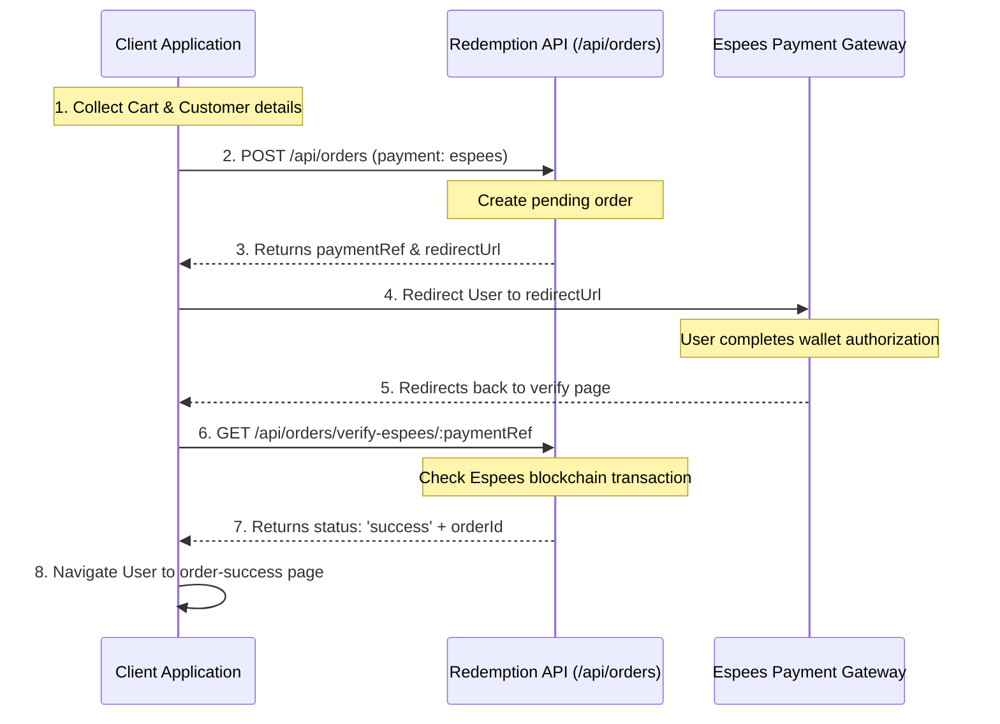

# Fashion Redemption Product API

Secure product integration API for chatbot systems, storefronts, and external applications.

---

## Overview

The Fashion Redemption Product API allows developers to:

- Retrieve products
- Search products
- Filter product collections (by category, color, size, price, etc.)
- Connect AI chatbots to product search
- Build external storefront integrations

This documentation only exposes integration-safe endpoints. Sensitive product architecture, internal inventory logic, admin routes, and protected operations are intentionally hidden for security purposes.

---

## Base URL

All API routes are versioned. The current base URL for product integration is:

```
https://fashion-redemption-api.onrender.com/api/v1/products
```

*Note: For backward compatibility, the unversioned route `/api/products` remains supported but versioned prefixing is highly recommended.*

---

## Environments

Since we haven't officially launched yet, our production environment is effectively serving as staging for now:

- **Sandbox / Testing URL**: `https://fashion-redemption-api.onrender.com`
- **Key usage**: There is no live customer traffic to worry about. Treat the current environment as your sandbox and test freely. 
- **Future plans**: Once we approach launch, we will separate staging and production properly and issue dedicated keys for each environment.

---

## Authentication

All requests require an API key passed in the headers or query parameters. API keys are protected and provided only upon request. Please contact the administrator to retrieve your integration key.

**Request Header**

```http
x-api-key: YOUR_API_KEY
```

**Query Parameter**

```
?api_key=YOUR_API_KEY
```

---

## Currency Policy

All product prices are stored and returned strictly in **ESP** (Espees / Pesetas) as a raw number.
- There is no automatic currency conversion (such as to GBP) on the backend server.
- To support **GBP** (or other currencies), you must manage exchange rates and calculate conversion client-side or within your bot integration using the ESP values returned by the API.

---

## Response Schema Reference

All successful endpoints return a standard response structure wrapper:

```json
{
  "success": true,
  "message": "Request completed successfully",
  "data": <DataBody>
}
```

### 1. Product List Schema

Each product in list response arrays (`data[]`) contains:

| Field | Type | Description |
| --- | --- | --- |
| `id` | string | Unique external ID of the product. |
| `name` | string | Product name. |
| `price` | number | Base product price in ESP. |
| `currency` | string | Currency unit (always `"ESP"`). |
| `category` | string | Target category (`"MEN"`, `"WOMEN"`, `"KIDS"`). |
| `rating` | number | Average user review rating (0.0 to 5.0). |
| `image` | string | URL of the primary product thumbnail. |
| `availability` | boolean | True if the product has stock remaining across variants. |
| `checkoutUrl` | string | Predefined checkout redirect URL to view details online. |

### 2. Product Detail Schema

A single product detail lookup (`GET /:id`) includes all fields from the list schema, plus:

| Field | Type | Description |
| --- | --- | --- |
| `description` | string | Detailed product details/marketing description. |
| `images` | array[string] | List of high-quality product image URLs. |
| `sizes` | array[string] | Available variant sizes (e.g., `["S", "M", "L", "XL"]`). |
| `colors` | array[string] | Available variant colors (e.g., `["BLACK", "BLUE"]`). |

---

## GET Endpoints

---

### 1. Get Products

Retrieve available products with optional filtering and pagination.

**Endpoint**

```
GET /api/v1/products
```

**Query Parameters**

| Parameter | Type   | Description |
| --------- | ------ | ----------- |
| `q`         | string | Keyword search on name and description |
| `category`  | string | Filter by category (`MEN`, `WOMEN`, `KIDS`) |
| `type`      | string | Filter by product type (e.g. `clothing`, `shoes`) |
| `color`     | string | Filter by color keyword (case-insensitive) |
| `size`      | string | Filter by variant size (e.g. `S`, `M`, `L`, `XL`, `XXL`) |
| `minPrice`  | number | Minimum base price (ESP) |
| `maxPrice`  | number | Maximum base price (ESP) |
| `sort`      | string | Sort order (e.g., `price_asc`, `price_desc`, `newest`) |
| `page`      | number | Pagination page number (default: `1`) |
| `limit`     | number | Items returned per page (default: `12`) |

**Example Request**

```bash
curl -X GET "https://fashion-redemption-api.onrender.com/api/v1/products?category=WOMEN&color=BLACK&size=M&page=1&limit=10" \
-H "x-api-key: YOUR_API_KEY"
```

**Example Response**

```json
{
  "success": true,
  "data": [
    {
      "id": "prod_1714310000000",
      "name": "Elegant Pleated Midi Dress",
      "price": 14000,
      "currency": "ESP",
      "category": "women",
      "rating": 4.8,
      "image": "https://fashion-redemption-api.onrender.com/images/products/women_elegant_pleated_midi_dress_1.jpg",
      "availability": true,
      "checkoutUrl": "https://fashion-redemption.vercel.app/product/prod_1714310000000"
    }
  ],
  "pagination": {
    "page": 1,
    "limit": 10,
    "total": 1
  }
}
```

---

### 2. Get Product Details

Retrieve detailed information about a single product.

**Endpoint**

```
GET /api/v1/products/:id
```

**Example Request**

```bash
curl -X GET "https://fashion-redemption-api.onrender.com/api/v1/products/prod_1714310000000" \
-H "x-api-key: YOUR_API_KEY"
```

**Example Response**

```json
{
  "success": true,
  "data": {
    "id": "prod_1714310000000",
    "name": "Elegant Pleated Midi Dress",
    "price": 14000,
    "currency": "ESP",
    "category": "women",
    "rating": 4.8,
    "image": "https://fashion-redemption-api.onrender.com/images/products/women_elegant_pleated_midi_dress_1.jpg",
    "availability": true,
    "checkoutUrl": "https://fashion-redemption.vercel.app/product/prod_1714310000000",
    "description": "An elegant pleated midi dress ideal for evening events and formal occasions.",
    "images": [
      "https://fashion-redemption-api.onrender.com/images/products/women_elegant_pleated_midi_dress_1.jpg",
      "https://fashion-redemption-api.onrender.com/images/products/women_elegant_pleated_midi_dress_2.jpg"
    ],
    "sizes": ["S", "M", "L"],
    "colors": ["Black", "Navy"]
  }
}
```

---

### 3. Search Products

Quick product keyword search optimized for auto-completion.

**Endpoint**

```
GET /api/v1/products/search
```

**Query Parameters**

| Parameter | Type   | Description |
| --------- | ------ | ----------- |
| `q`         | string | Search keyword |

**Example Request**

```bash
curl -X GET "https://fashion-redemption-api.onrender.com/api/v1/products/search?q=dress" \
-H "x-api-key: YOUR_API_KEY"
```

**Example Response**

```json
{
  "success": true,
  "data": [
    {
      "id": "prod_1714310000000",
      "name": "Elegant Pleated Midi Dress",
      "price": 14000,
      "currency": "ESP",
      "category": "women",
      "rating": 4.8,
      "image": "https://fashion-redemption-api.onrender.com/images/products/women_elegant_pleated_midi_dress_1.jpg",
      "availability": true,
      "checkoutUrl": "https://fashion-redemption.vercel.app/product/prod_1714310000000"
    }
  ]
}
```

---

## POST Endpoints

---

### 1. Chatbot Product Query

Optimized query parsing endpoint designed for NLP-driven search in AI chatbots. Automatically detects colors, category, size, price ranges, and status keyword queries.

**Endpoint**

```
POST /api/v1/products/chatbot/query
```

**Request Body**

```json
{
  "message": "Show me a medium black dress under 15000 ESP"
}
```

**Example Request**

```bash
curl -X POST "https://fashion-redemption-api.onrender.com/api/v1/products/chatbot/query" \
-H "Content-Type: application/json" \
-H "x-api-key: YOUR_API_KEY" \
-d '{
  "message": "Show me a medium black dress under 15000 ESP"
}'
```

**Example Response**

```json
{
  "success": true,
  "message": "Products retrieved successfully",
  "data": [
    {
      "id": "prod_1714310000000",
      "name": "Elegant Pleated Midi Dress",
      "price": 14000,
      "currency": "ESP",
      "category": "women",
      "rating": 4.8,
      "image": "https://fashion-redemption-api.onrender.com/images/products/women_elegant_pleated_midi_dress_1.jpg",
      "availability": true,
      "checkoutUrl": "https://fashion-redemption.vercel.app/product/prod_1714310000000"
    }
  ]
}
```

---

## Order Integration & Flow

Shopping cart operations are maintained **entirely on the client side** (e.g. locally in memory or local storage). The backend does not supply a cart state management API. 

The complete checkout lifecycle is outlined below:



### Step 1: Submit Order

Once a user is ready to complete their purchase, dispatch a `POST` request to `/api/orders`.

**Endpoint**

```
POST /api/orders
```

**Request Body Schema**

```json
{
  "customer": {
    "fullName": "Jane Doe",
    "email": "jane@example.com",
    "address": "Calle Mayor 12",
    "city": "Madrid",
    "postalCode": "28001"
  },
  "shipping": {
    "method": "standard",
    "price": 1500
  },
  "payment": {
    "method": "espees"
  },
  "totals": {
    "subtotal": 14000,
    "tax": 2940,
    "discount": 0,
    "total": 18440
  },
  "items": [
    {
      "id": "prod_1714310000000",
      "name": "Elegant Pleated Midi Dress",
      "price": 14000,
      "quantity": 1,
      "size": "M",
      "color": "Black",
      "image": "https://fashion-redemption-api.onrender.com/images/products/women_elegant_pleated_midi_dress_1.jpg"
    }
  ]
}
```

**Response Payload (Pending payment redirects)**

If the payment method chosen is `"espees"`, the server returns a `paymentRef` and `redirectUrl`:

```json
{
  "id": 104,
  "status": "pending",
  "total": 18440,
  "subtotal": 14000,
  "shipping_method": "standard",
  "shipping_price": 1500,
  "payment_method": "espees",
  "customer_name": "Jane Doe",
  "customer_email": "jane@example.com",
  "paymentRef": "esp_pay_908f731a-e89a",
  "redirectUrl": "https://espees-payments.vercel.app/pay/esp_pay_908f731a-e89a"
}
```

Redirect the user directly to the provided `redirectUrl` to authorize and complete the payment on the Espees system.

---

### Step 2: Verify Payment Status

After the customer completes the transaction, you must verify the success of the payment from your integration.

**Endpoint**

```
GET /api/orders/verify-espees/:paymentRef
```

**Example Request**

```bash
curl -X GET "https://fashion-redemption-api.onrender.com/api/orders/verify-espees/esp_pay_908f731a-e89a" \
-H "x-api-key: YOUR_API_KEY"
```

**Success Response**

```json
{
  "status": "success",
  "orderId": 104
}
```

**Pending / Failed Response**

```json
{
  "status": "failed",
  "message": "Insufficient wallet balance"
}
```

---

### Step 3: Success Landing Page

Upon receiving a successful verification status, redirect the customer to the central Order Success landing page to conclude the transaction:

```
https://fashion-redemption.vercel.app/order-success?orderId={orderId}
```

---

## Error Handling & Reference

The API uses standard HTTP response codes to indicate the status of requests. Errors are returned in a standard format:

```json
{
  "success": false,
  "message": "Error details here"
}
```

### 1. HTTP 400 — Bad Request

Returned when a request is missing required inputs or has malformed JSON.

```json
{
  "success": false,
  "message": "A \"message\" string is required in the request body."
}
```

### 2. HTTP 401 — Unauthorized

Returned when the `x-api-key` header or parameter is completely missing.

```json
{
  "success": false,
  "message": "Unauthorized: API key is missing. Please provide x-api-key header."
}
```

### 3. HTTP 403 — Forbidden

Returned when the provided API key is invalid or expired.

```json
{
  "success": false,
  "message": "Forbidden: Invalid API key."
}
```

### 4. HTTP 404 — Not Found

Returned when a product or resource ID cannot be located in the database.

```json
{
  "success": false,
  "message": "Product not found"
}
```

### 5. HTTP 429 — Too Many Requests

Enforced on all API routes. Rate limiting is restricted to **100 requests per 15 minutes per IP address**. When triggered, callers must implement exponential backoff.

```json
{
  "success": false,
  "message": "Too many requests. Please try again after 15 minutes."
}
```

### 6. HTTP 500 — Internal Server Error

Returned when an unhandled database exception or internal runtime error occurs.

```json
{
  "success": false,
  "message": "Failed to retrieve products"
}
```

---

## Best Practices

- **Store API Keys Securely**: Never expose the API key directly in client-side static bundles. Use backend proxy routing when implementing storefront client calls.
- **Implement Exponential Backoff**: Ensure your systems handle `429 Too Many Requests` status codes gracefully by slowing down requests on retries.
- **Cache Product Catalog**: Since products update infrequently, store catalogs or key lookups in memory cache (Redis/LocalCache) to reduce HTTP load.
